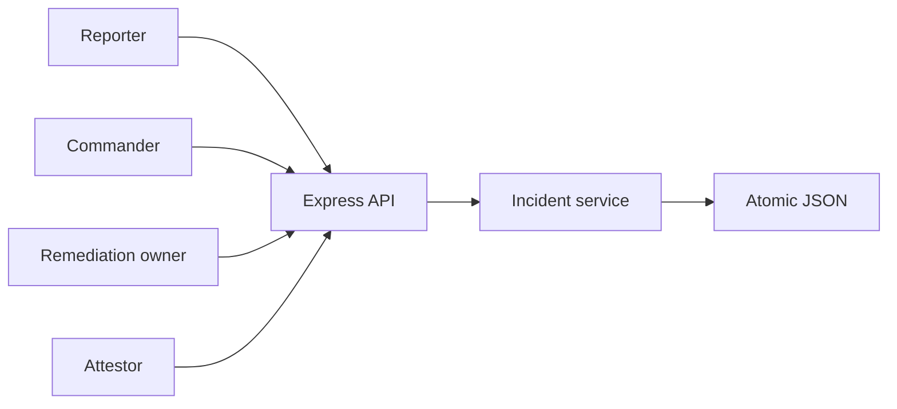
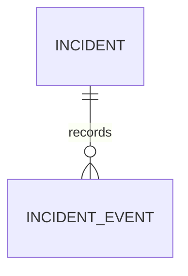
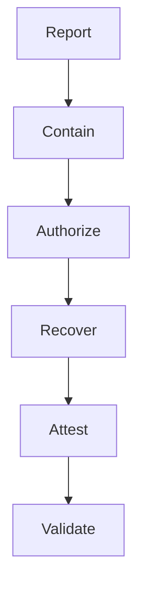
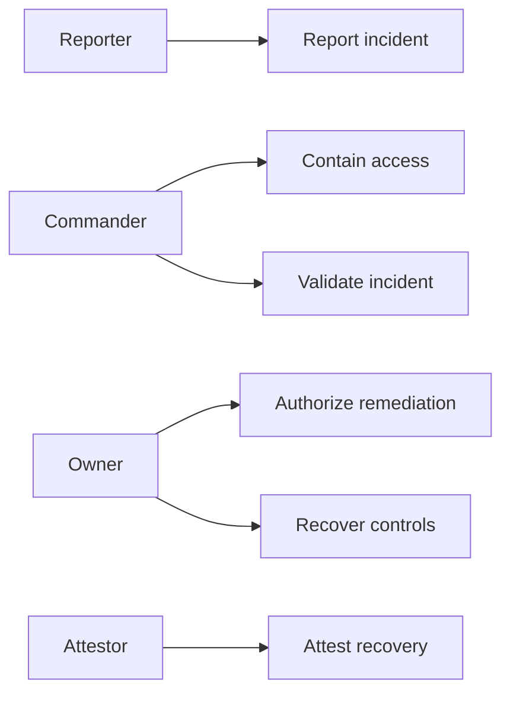
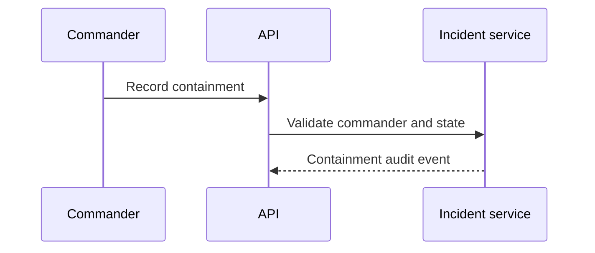

# Supplier Evidence Access Incident Containment Platform
## The Problem
An evidence access incident requires fast containment and disciplined recovery. When controls are handled through informal messages, teams cannot reliably prove that access was contained, remediation authority was established, recovery was verified, and the incident received an independent attestation.
## The Solution
This service controls the incident lifecycle. A reporter records an incident, an incident commander assigns containment, the remediation owner authorizes and performs recovery, a control attestor confirms recovery, and the commander validates the final record.
## Live Demo and Tech Stack
Run `http://localhost:59900/health`. The stack uses Node.js 22, Express 5, atomic JSON persistence, Vitest, and GitHub Actions. The service binds to `0.0.0.0` for LAN operation.
## Local Setup and Run Instructions
```bash
npm install
npm test
env -u PORT node server.mjs
```
## System Documentation
### System Architecture Diagram

### Entity Relationship Diagram

### Data Flow Diagram

### Use Case Diagram

### Sequence Diagram

## Owner

Created and maintained by Kholipha Ahmmad Al-Amin.

Software Engineer and AI Specialist

Founder and CEO of EquiSaaS BD

Principal Consultant at AR IT Consultancy

Full Stack Developer and SaaS Product Builder

### Official links

Portfolio: https://kholipha-ahmmad-al-amin.equisaas-bd.com/

GitHub: https://github.com/kholipha-ahmmad-al-amin

LinkedIn: https://www.linkedin.com/in/kholipha-ahmmad-al-amin

X: https://x.com/al_amin5519

Facebook: https://www.facebook.com/kholipha.ahmmad.al.amin

Instagram: https://www.instagram.com/kholipha.ahmmad.al.amin

## Ownership

This project was created and is maintained by Kholipha Ahmmad Al-Amin.

